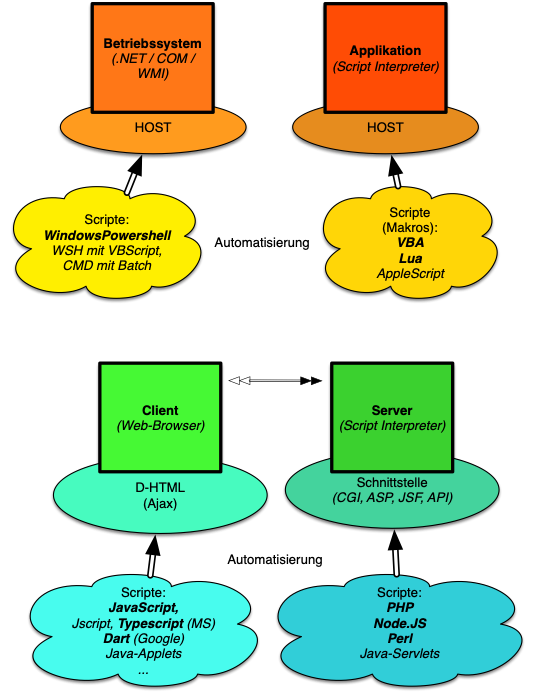
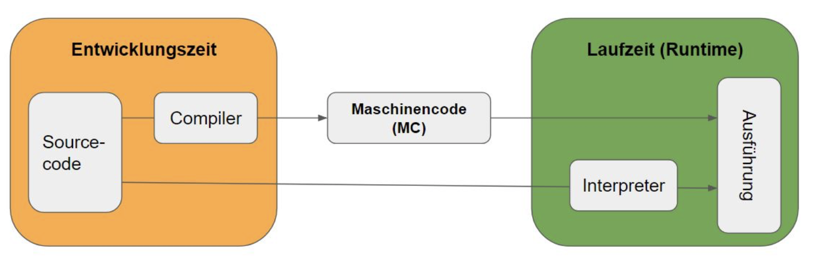

# Einführung ins Modul 122 - Abläufe mit einer Scriptsprache automatisieren

Es gibt vier Hauptanwendungsbereiche für die Automatisierung von Abläufen mit einer Scriptsprache:

| Anwendungsbereich  | Skriptsprache                                                                                                                    | Zweck                                                                                                    |
| ------------------ | -------------------------------------------------------------------------------------------------------------------------------- | -------------------------------------------------------------------------------------------------------- |
| **Betriebssystem** | **Bash (Unix, Linux, MacOs)**   Bash (DOS, WINDOWS CMD)   Powershell (WINDOWS, Linux)   AppleScript (macOS)   Python | Skripte für Login, Installation, Konfiguration usw. für das Betriebssystem oder dessen Nutzer(-accounts) |
| **Applikation**    | VBA (MS Office, Libre Office) LUA (Für eigene App) AppleScript (mac-Apps) UnityScript (Unity)                                    | Ausführen von Abläufen innerhalb der Applikation                                                         |
| **Web**            | JavaScript (Browser)   PHP (Server)   Python (Server)                                                                      | Automatisierung von Webseiten, Webapplikationen, Webservern                                              |
| **WEB-Server**     | PHP (Server)   Python (Server)                                                                                                | Automatisierung von Webservern                                                                           |

## Kommandozeileninterpreter

Einige Skriptsprachen sind von den Kommandozeileninterpretern der Betriebssysteme abgeleitet. Die Interpreter sind hauptsächlich für die interaktive Benutzung, d.h. die Eingabe von Befehlen, ausgelegt.

_Wissenswert: Bei einem Interpreter wird der Programmtext Zeile für Zeile abgearbeitet, wobei er das Programm auf Fehler überprüft. Jeder gefundene Fehler führt bei einem Interpreter zum Abbruch der Übersetzung; die fehlerhafte Zeile wird angezeigt und kann korrigiert werden. Anschließend kann der Übersetzungsprozess neu gestartet werden. Leider wird die Fehlerprüfung auch dann beibehalten, wenn das Programm fehlerfrei und lauffähig ist, und somit recht viel Zeit erforderlich ist! Die von einem Interpreter übersetzten Programme sind relativ langsam und daher für komplexe Lösungen ungeeignet >> Hochsprachen mit Compiler._

Die Eingabesprache wird um Variablen, arithmetische Ausdrücke, Kontrollstrukturen (if, while) und anderes erweitert und ermöglicht so die Automatisierung von Aufgaben (z.B. bei der unbeaufsichtigten Installation), indem "kleine Programme" in Dateien geschrieben werden. Diese Dateien können dann vom Interpreter ausgeführt werden. Die Dateien werden unter dem Betriebssystem Unix/Linux als **Shellskripte** bezeichnet (ausgeführt von einer der Unix-Shells bash, csh ...) oder unter DOS und Windows auch als Stapelverarbeitungsdateien oder Batch-Skripte (ausgeführt von cmd.exe, powershell.exe). (Quelle: Wikipedia)

In diesem Modul beginnen wir mit **Bash auf einem Linux-System** ...
